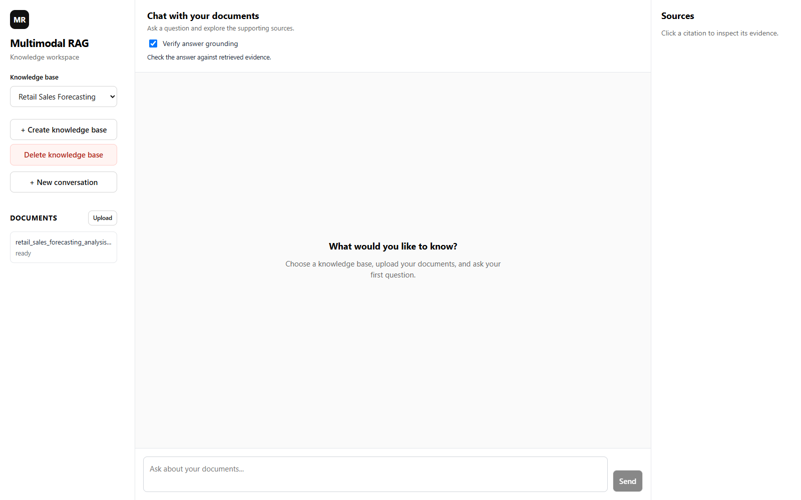
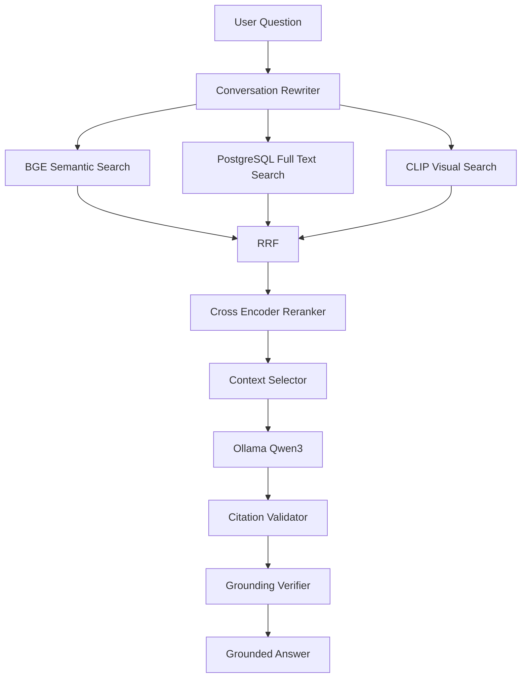
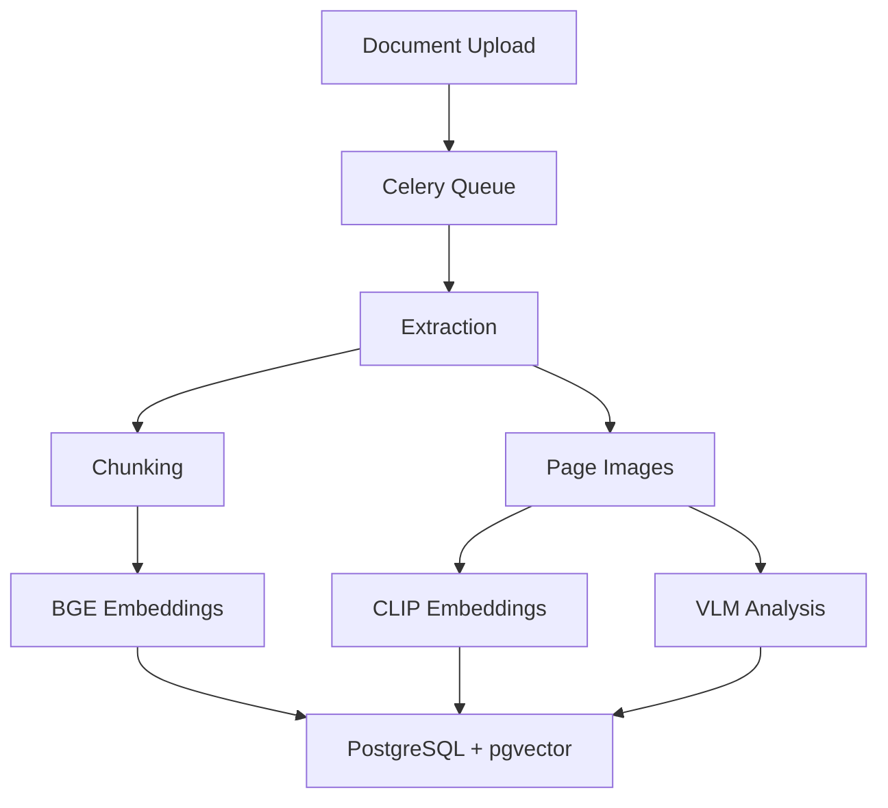
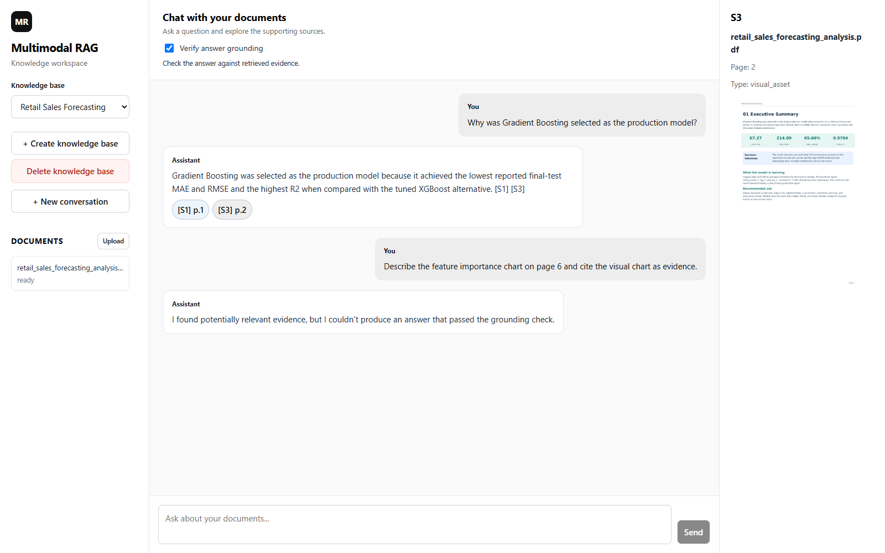
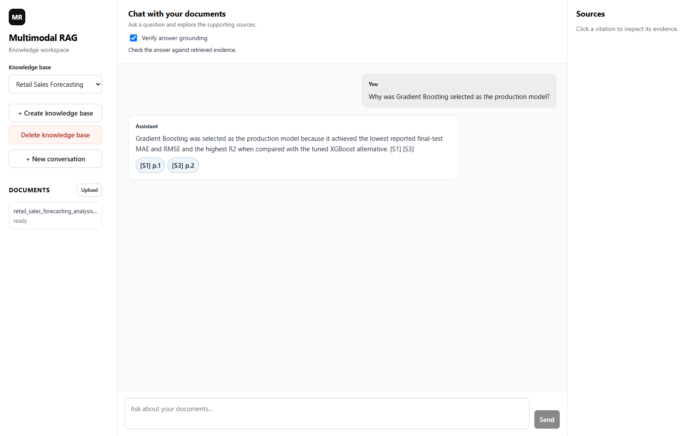
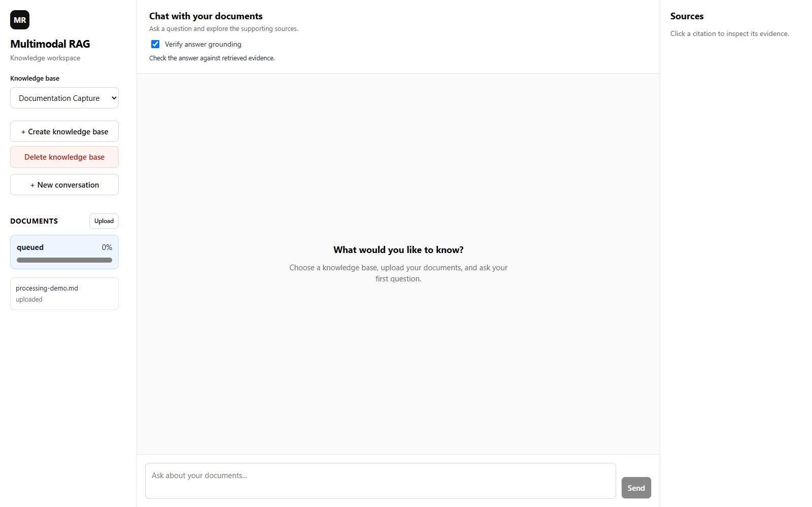
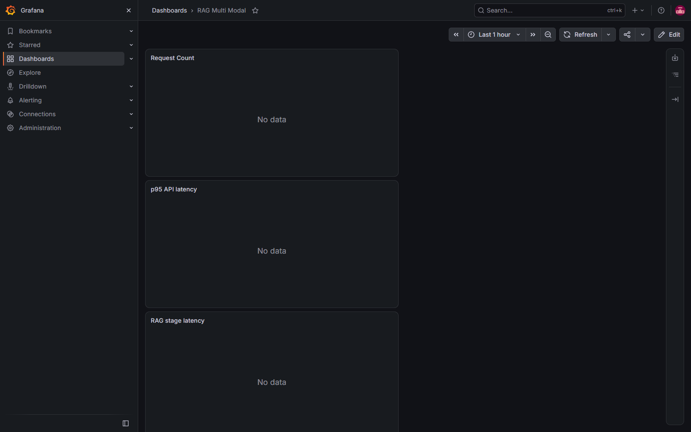
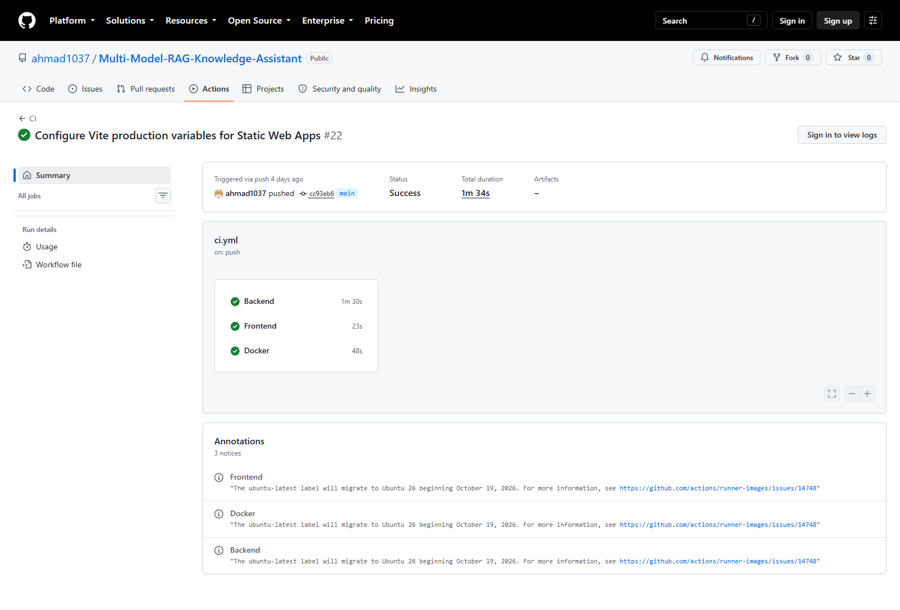
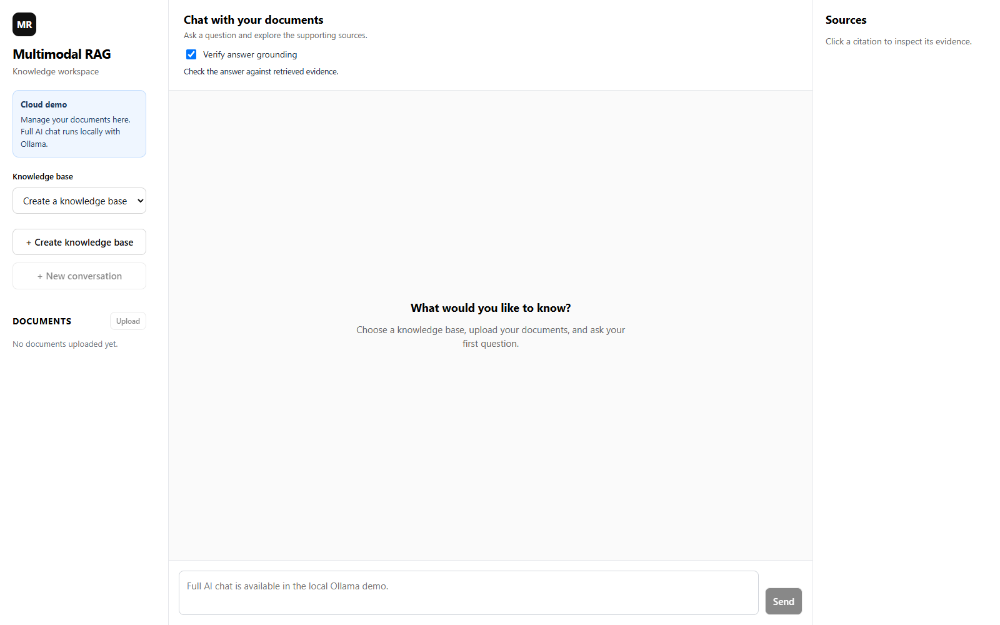

# Multimodal RAG Knowledge Assistant

A local-first document assistant that searches text and page images, combines retrieval signals, and answers with inspectable citations. FastAPI serves the RAG pipeline; React provides chat, source inspection, and background-upload progress. An Azure infrastructure preview demonstrates the web interface without hosting local AI inference.



## What It Does

Upload documents into a knowledge base, ask questions, and open the sources behind an answer. The assistant rewrites follow-up questions using conversation history, retrieves evidence from PostgreSQL, and can refuse answers that lack support or fail verification.

The [Azure preview](https://agreeable-bay-0a770bc0f.2.azurestaticapps.net/) is an infrastructure demonstration. Run locally for Ollama generation and multimodal inference.

## Architecture

The query path separates retrieval, ranking, context selection, generation, and validation:



This is the normal verified-answer path. Clarification, refusal, retries, an optional verification toggle, and a deterministic table-comparison path are implemented separately. A final verification flag alone does not establish first-pass success.

Document ingestion runs in a worker:



The ingestion diagram shows data dependencies, not parallel execution. The current worker processes stages sequentially; visual stages run when extracted visual assets exist.

## Features

- Knowledge-base creation, selection, deletion, and document upload.
- Semantic, lexical, visual, and fused retrieval APIs with exact/HNSW vector search.
- Cross-encoder reranking and bounded context selection.
- Inline source identifiers and a source panel with document/page information and visual previews.
- Conversation rewriting, clarification handling, recent history, and summaries.
- Celery processing jobs with progress, retries, and interrupted-job recovery.
- Structured logs, Prometheus instrumentation, and a Grafana datasource.

## Technology Stack

### Frontend

- React 19, TypeScript, Vite, CSS.

### Backend

- Python 3.12, FastAPI, Pydantic, SQLAlchemy, Alembic.

### Retrieval

- BGE (`BAAI/bge-small-en-v1.5`), PostgreSQL full-text search, pgvector, HNSW.
- CLIP (`ViT-B-32`, OpenAI pretrained weights), Reciprocal Rank Fusion.
- Cross-encoder reranker (`BAAI/bge-reranker-base`).

### Generative AI

- Ollama with `qwen3:8b` for generation, verification, and conversational rewriting.
- `Qwen/Qwen2.5-VL-3B-Instruct` for visual analysis.

### Infrastructure

- Docker Compose, Celery, Redis, Prometheus, Grafana, GitHub Actions, GHCR.
- Azure preview integration: Static Web Apps, Container Apps, PostgreSQL, and Blob Storage support. Live resource verification is described in [cost guardrails](infra/COST_GUARDRAILS.md).

## RAG Pipeline

1. Resolve references in a conversation question, or request clarification.
2. Search text embeddings, PostgreSQL full-text indexes, and CLIP visual embeddings.
3. Fuse channel rankings with RRF and rerank candidates with a cross encoder.
4. Select evidence within token, item, page, and visual-item limits.
5. Generate a structured answer with inline citations.
6. Validate citation IDs and, when enabled, check grounding; retry or refuse on failure.

The context pipeline currently requests 20 candidates and 10 reranked results. Default context limits are 1,800 tokens, 8 items, and 3 visual items. Settings and endpoint payloads must be recorded when comparing configurations.

## Multimodal Retrieval

BGE retrieves text passages. CLIP supports text-to-image and image-to-image search over extracted page images and embedded visuals. VLM descriptions make visual content available to later evidence processing. The hybrid implementation already uses RRF: “Hybrid + CLIP” and “Hybrid + RRF” are not independent measured ablations here.



This capture shows an actual cited page asset. A page preview is not proof of accurate chart interpretation; chart-focused prompts can still fail grounding.

## Grounding & Hallucination Control

Answers use source IDs such as `[S1]`. Citation validation checks that inline IDs, declared IDs, and supplied evidence agree. The optional verifier checks an answer against retrieved evidence, with a bounded retry before refusal. Conversation context is used for reference resolution and is not a citable source.

These controls reduce unsupported output; they do not prove factual correctness. Structural citation validity and independently supported claims are different measurements.



## Conversational Memory

Conversation records store messages, citations, and metadata. The rewriter uses recent messages and a summary to form a standalone retrieval query. Defaults retain 8 recent messages and trigger summarization after 12 messages, with a refresh interval of 8 messages. The system can ask for clarification instead of guessing a referent.

In the captured benchmark, the follow-up was rewritten but its final answer was refused after grounding failed. No clarification-accuracy or memory-drift score is available because those labeled cases are absent.

## Background Processing

Uploads create processing jobs and enqueue Celery tasks through Redis. The worker records extraction, chunking, text embedding, visual analysis, visual embedding, and completion stages. The frontend polls progress; failures and retries remain visible. The current Compose worker runs with concurrency 1.

See [screenshot provenance and capture status](docs/images/README.md) for the processing capture and final job state. The screenshot demo uses a separate knowledge base and is excluded from benchmark evidence.



## Evaluation Results

Results below come from the **2026-09-23 run `20260923T122235Z`**, not from screenshots or unit tests. The five [final JSON reports](evaluation/results/final/) use the [Milestone 12 reporting utility](backend/app/rag/evaluation/reporting.py). They include report timestamps, source-run timestamps, models, configuration provenance, metric definitions, and raw evidence. `null` means unmeasured, not zero.

All **43 endpoint requests returned HTTP 200**: 12 chunking, 3 visual, 24 hybrid, 2 generation, and 2 conversation turns. This demonstrates endpoint recovery after the cache-permission fix, not retrieval accuracy.

### Retrieval comparison

| Pipeline | Recall@5 | MRR | nDCG@5 | Measurement status |
|---|---:|---:|---:|---|
| BGE semantic | N/A | N/A | N/A | Responses captured; source labels do not match loaded corpus |
| Semantic + lexical | N/A | N/A | N/A | No comparable ablation captured |
| Hybrid + CLIP | N/A | N/A | N/A | Existing hybrid already uses RRF; no separate unfused variant |
| Hybrid + RRF | N/A | N/A | N/A | Responses captured; source labels do not match loaded corpus |
| Hybrid + reranker | N/A | N/A | N/A | No reranking quality ablation captured |

Recall@1 and Recall@3 are also unmeasured. Fixtures expect `model_comparison.md`, `retail_report.pdf`, or `retail_sales_forecasting_analysis(1).pdf`; the observed retail corpus contains `retail_sales_forecasting_analysis.pdf`. No unreviewed filename aliases were applied. The legacy helper called `recall_at_k` measures any-hit success, so actual recall/nDCG also require a defined relevant-document/page/chunk set.

### Generation

| Generation metric | Result | Scope |
|---|---:|---|
| Citation validity | 100% (1/1) | Structural ID consistency in the single answered output; not factual accuracy |
| Supported claim rate | N/A | No independently annotated claim inventory |
| Answerability accuracy | 100% (2/2) | Agreement with two existing boolean labels; source mismatch remains |
| Refusal accuracy | 100% (1/1) | Single expected-unanswerable question |
| Grounding first-pass rate | N/A | No per-case first-attempt trace captured |

These tiny diagnostic samples do not establish general accuracy. The conversation rewrite differs literally from its reference (**0/1 exact match**), but semantic rewrite accuracy has not been adjudicated. The follow-up answer was refused (**0/1 answer success**); its retrieval success cannot be inferred from that refusal.

### Performance

One serial pass, with startup included and no discarded warmup. Percentiles use linear interpolation of client wall-clock durations. In particular, the two-sample generation/conversation p95 values are not reliable production tail-latency estimates.

| Endpoint group | Requests | p50 | p95 |
|---|---:|---:|---:|
| Semantic/chunking | 12 | 68.26 ms | 5,881.70 ms |
| Visual retrieval | 3 | 68.98 ms | 3,580.01 ms |
| Hybrid retrieval | 24 | 80.05 ms | 95.66 ms |
| Generation | 2 | 16,972.84 ms | 31,144.83 ms |
| Conversation turns | 2 | 5,778.15 ms | 7,729.02 ms |

Run-window Ollama telemetry: **10,760 prompt tokens**, **1,067 output tokens**, and **92.40 output tokens/sec mean per call**, across 11 generation, verification, and rewriting calls. This is an arithmetic mean of per-call decode speeds, not end-to-end throughput. The [performance report](evaluation/results/final/performance.json) separates operations and documents shared-process telemetry limitations.

Reproduce capture and reporting from `backend`:

```powershell
uv run python -m scripts.evaluate_final
uv run python -m scripts.publish_final_results --run 20260923T122235Z
```

The second command republishes the recorded run; replace its ID to summarize a compatible new capture. Refresh the non-secret runtime snapshot as described in [the final-results guide](evaluation/results/final/README.md). The capture runner collects evidence; it is not a complete quality-scoring harness.

## Observability

Structured logs record request IDs, stages, errors, and model operations. `/metrics/` exposes HTTP/RAG latency, retrieval counts, answer outcomes, grounding retries, and Ollama token/timing histograms. Prometheus and Grafana are included in Compose.



The dashboard showed **No data** in this capture. Do not interpret it as a populated performance dashboard. Benchmark telemetry above comes from saved `/metrics/` snapshots. Prometheus scrape health and dashboard queries still need verification; the backend's default trusted-host list does not include the Compose hostname `backend`.

## Security

The backend includes trusted-host checks, configurable CORS, upload extension/size checks, security headers, and non-root Docker execution. Secrets belong in environment variables; `.env` is ignored by Git. Existing cache volumes need the ownership migration in [cache setup](backend/CACHE_SETUP.md).

This is a development/demo application, not a hardened multi-tenant service. Authentication, per-user authorization, rate limiting, and document-level access controls are future work. Change development credentials before exposing services. The prompt's evidence boundary is not a complete prompt-injection defense.

Local verification passed **51 backend tests and Ruff** during the cache fix. Unit tests mock database/model behavior and do not replace live inference evaluation. GitHub CI additionally provisions database/Redis services and runs migrations/builds.



This is historical **CI #22**, commit `cc93eb6`, [run 35432369549](https://github.com/ahmad1037/Multi-Model-RAG-Knowledge-Assistant/actions/runs/35432369549). At capture time, latest **CI #26**, commit `5bbc8b4`, [was failing](https://github.com/ahmad1037/Multi-Model-RAG-Knowledge-Assistant/actions/runs/35433088768). [Current workflow overview](docs/images/github-actions-current.png) preserves that evidence. No claim is made that current uncommitted changes have passed remote CI.

## Local Installation

Prerequisites: Git, Docker Desktop/Compose with NVIDIA GPU support for the supplied GPU configuration, Ollama, Python 3.12 with `uv`, and Node.js 22 for frontend development. Model downloads and local inference require sufficient disk and memory; no minimum-hardware benchmark has been established.

```powershell
git clone https://github.com/ahmad1037/Multi-Model-RAG-Knowledge-Assistant.git
cd Multi-Model-RAG-Knowledge-Assistant
Copy-Item .env.example .env
```

Review `.env`: choose database credentials, keep local inference enabled, and set `HF_TOKEN` to a valid token or leave it blank rather than retaining the example self-reference. In containers, Ollama uses `http://host.docker.internal:11434`; a natively run backend uses `http://localhost:11434`.

Start the installed Ollama service and pull the configured generation model:

```powershell
ollama pull qwen3:8b
docker compose up -d --build
```

Compose applies Alembic migrations before starting the backend. BGE, CLIP, reranker, and VLM weights load/download when their operations first run. For an existing root-owned model cache, follow [the one-time cache migration](backend/CACHE_SETUP.md). CPU-only execution needs device settings **and** removal of Compose's NVIDIA device reservations; changing an environment variable alone is insufficient.

| Service | Local URL |
|---|---|
| Frontend | http://localhost:5173 |
| API docs, when enabled | http://localhost:8000/docs |
| Metrics | http://localhost:8000/metrics/ |
| Prometheus | http://localhost:9090 |
| Grafana | http://localhost:3000 |

For development checks:

```powershell
cd backend
uv sync --frozen
uv run ruff check app tests scripts
uv run pytest -q
cd ../frontend
npm ci
npm run build
```

The `backend/scripts/smoke_*.py` scripts are separate manual model checks. Keep unit tests, endpoint availability, and benchmark quality results distinct.

## Azure Infrastructure Preview



[Open the preview](https://agreeable-bay-0a770bc0f.2.azurestaticapps.net/). The captured page labels cloud mode and disables full AI chat. Its empty document list is not evidence of a populated cloud corpus or verified database connectivity.

Backend `DEPLOYMENT_MODE=cloud_infrastructure` and frontend `VITE_DEPLOYMENT_MODE=cloud_infrastructure` separate this preview from local inference. Ollama, VLM analysis, and GPU retrieval are not hosted by this preview. The backend publishing workflow targets GHCR; the frontend workflow deploys Static Web Apps.

Follow [Azure cost guardrails](infra/COST_GUARDRAILS.md): Consumption Container Apps with 0–1 replicas, 0.5 vCPU/1 GiB, no cloud AI/GPU, and no persistent Log Analytics. These are intended constraints, not a guarantee of zero cost. Azure CLI discovery timed out during this documentation capture, so live resource settings were not revalidated.

## Project Structure

```text
backend/
  app/api/              FastAPI routes
  app/rag/              Retrieval, generation, vision, memory, evaluation
  app/services/         Ingestion and RAG orchestration
  app/worker/           Celery jobs
  scripts/              Live capture and final-report publishing
  tests/                Backend tests
frontend/src/           React chat and source/processing panels
database/               Database initialization
evaluation/
  datasets/             Chunking, visual, hybrid, generation, conversation
  results/final/        Reports, configuration, and captured evidence
docs/images/            Real screenshots and provenance
docs/scripts/           Screenshot capture script
monitoring/             Prometheus and Grafana configuration
infra/                  Azure cost guardrails
.github/workflows/      CI and deployment workflows
storage/                Local document and visual assets
```

## Known Limitations

- Retrieval fixtures name documents absent from the loaded benchmark corpus. Recall, MRR, and nDCG comparisons remain unmeasured.
- Generation has only two labeled cases; conversation has one follow-up. Clarification, drift resistance, independent claim support, and first-pass grounding need dedicated evaluation.
- The measured follow-up failed grounding and was refused. A chart-focused screenshot prompt also failed grounding. Dense-chart/small-text reading by the local 3B VLM has no measured accuracy here.
- Cold startup is materially slower than warmed retrieval. qwen3:8b latency depends on hardware, model residency, context, and verification/retries.
- Ambiguous follow-ups can require clarification. Recent history and summaries do not guarantee resistance to memory drift.
- Latest observed remote CI was failing despite local test success. The Grafana screenshot has no data; monitoring integration needs follow-up verification.
- The Azure preview does not host the expensive local inference models. Cloud resource health and configuration are not fully verified.
- Authentication and fine-grained access controls are not implemented for a production multi-user deployment.

## Future Improvements

- Restore or independently relabel the benchmark corpus and freeze dataset/corpus versions.
- Run semantic, lexical, visual, fusion, and reranking ablations on the same relevance judgments.
- Add claim-level support adjudication, first-attempt traces, clarification cases, and long-history drift tests.
- Measure warm/cold latency under repeated runs and concurrency with recorded hardware.
- Investigate grounding-refusal cases, restore remote CI, and verify Prometheus/Grafana integration.
- Add authentication, authorization, rate limits, and broader prompt-injection tests before public multi-user use.
